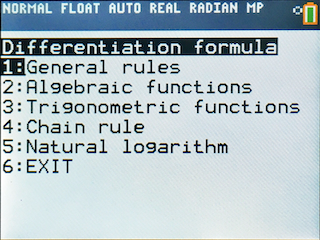
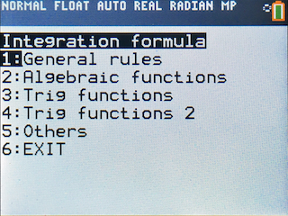
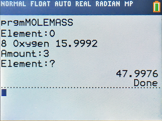
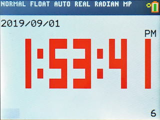

# TI-84PCE-Programs
This is the repository that hosts the programs that I created for TI-84 Plus CE Calculator.

## File Structure
Each folder holds 1 program. The ```.txt``` version may have unprintable characters.
```
.
├── DIFFFORM
│   ├── DIFFFORM.8xp
│   └── DIFFFORM.txt
├── INTEFORM
│   ├── INTEFORM.8xp
│   └── INTEFORM.txt
├── MOLEMASS
│   ├── MOLEMASS.8xp
│   └── MOLEMASS.txt
├── TIMEDISP
│   ├── TIMEDISP.8xp
│   └── TIMEDISP.txt
├── docs
│   └── README.md
└── images
    ├── DIFFFORM.png
    ├── INTEFORM.png
    ├── MOLEMASS.png
    └── TIMEDISP.png
```

## List of Programs

### DIFFFORM
This program stores common differential formulas. Useful when you want a handy reference on the calculator.
<br>


### INTEFORM
This program stores common integration formulas. Useful when you want a handy reference on the calculator.
<br>


### MOLEMASS
This program calculates molar mass for you. Type in how many of each element in the molecule and end with an non-exist element. Atomic weight data was taken from Wikipedea.
<br>


### TIMEDISP
This program shows a clock on the screen and refreshes every second. Hold ```del``` for 3 seconds to exit program. It requires ```TEXTLIB``` to work.
<br>


## System Version Requirement
Last checked to be working on 5.4.0.0034
